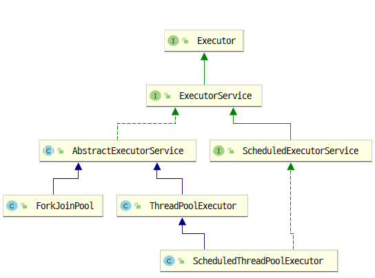

# org.platformfarm.knowledgebase.concurrent
It's a knowledge base related to concurrency.
## basic package 
동시성 프로그래밍이 필요한 기초적인 이유에 대한 정리를 한 패키지이다.

### ConcurrencyUnconsidered class
동시성에 대한 아무런 개념이 없는 상태에서 thread 코드를 작성하는 경우 발생하는 문제를 시뮬레이션 
하는 Class 이다.

### HowToUseExecutorService class
ExecutorService 를 이용하여 thread pool 을 구성하여 사용하는 예제를 정리 하는 Class 이다. 관련된 
알고리즘은 ExceptionHandlingThreadPoolExecutor class 에 구현되어 있다. 

 [thread pool internal]

 [Executor Framework]

> 테스트 클래스: HowToUseExecutorServiceTest

### ExceptionHandlingThreadPoolExecutor
Executor 의 submit 는 task 내부에서 오류가 발생하면 오류를 전파 시키지 않는다. 스레드이 파괴 없이 
그대로 스레드를 재활용하기 위해서라고 한다. 어찌 했던 응용 프로그램 입장에서는 예외가 발생했는지도
모르고 지나칠 우려가 있어 이를 헨들링하기 위한 방법으로 ThreadPoolExecutor 를 확장하는 방법을 이 
클래스에서 제시한다. 원리는 afterExecute 함수를 override 하여 Future 객체를 get 하는 시점에 예외를 
얻어는 방법으로 예외를 검출한다. 나는 이 과정에서 Runtime exception 을 캐치하여 throw 하였다.
 

### ExExecutors
ExceptionHandlingThreadPoolExecutor 의 Factory Interface

### FolderProcessor
폴더를 순회 화면서 특정 확장자의 파일 리스트(List<String>)를 수집하는 Class. 이 클래스를 이용하여 
ForkJoinPool 에 작업을 요청한다.
> 테스트 클래스: FolderProcessorTest 

### SingleThreadFolderProcessor
FolderProcessor class 를 이용한 ForkJoinPool 의 성능을 비교하기 위해 단일 스레드로 동작하는 Class 를
정의하였다. 단일 스레드 뿐만 아니라 fixed thread pool 의 동작도 test 하는 목적으로 사용된다.

